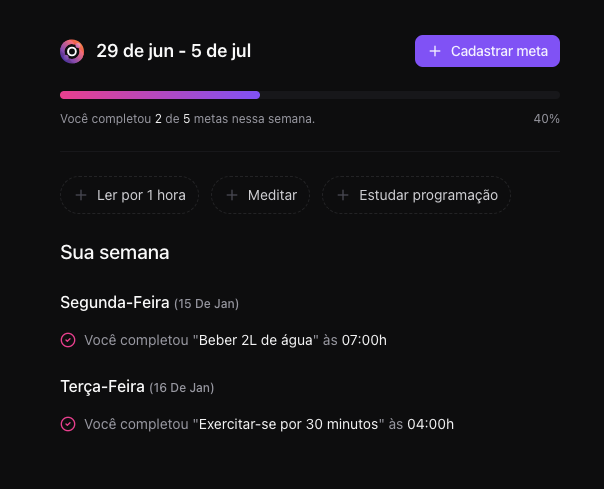

# In.Orbit - Gerenciador de Metas Semanais



Este projeto foi desenvolvido durante o evento **NLW Pocket: JavaScript** da Rocketseat e consiste em uma aplicação web para gerenciamento de metas semanais.

## 📋 Sobre o Projeto

O **In.Orbit** é uma aplicação que permite aos usuários:

- ✅ Cadastrar metas semanais
- 📊 Acompanhar o progresso das metas através de uma barra de progresso
- 📅 Visualizar metas pendentes e completadas por dia da semana
- 🎯 Marcar metas como concluídas
- 📈 Ver estatísticas de conclusão semanal

A aplicação possui uma interface moderna e responsiva, com tema escuro e elementos visuais inspirados no espaço.

## 🚀 Tecnologias Utilizadas

- **React 18** - Biblioteca para construção da interface
- **TypeScript** - Superset do JavaScript com tipagem estática
- **Vite** - Build tool e servidor de desenvolvimento
- **Tailwind CSS** - Framework CSS utilitário
- **Radix UI** - Componentes acessíveis e não estilizados
- **React Hook Form** - Gerenciamento de formulários
- **Zod** - Validação de esquemas
- **TanStack Query** - Gerenciamento de estado servidor
- **Day.js** - Manipulação de datas
- **Lucide React** - Ícones

## 📦 Instalação e Execução

### Pré-requisitos

- Node.js (versão 16 ou superior)
- Yarn ou npm

### Passos para executar o projeto

1. **Clone o repositório:**
```bash
git clone <url-do-repositorio>
cd nlw-pocket-js-react
```

2. **Instale as dependências:**
```bash
yarn install
# ou
npm install
```

3. **Execute o projeto em modo de desenvolvimento:**
```bash
yarn dev
# ou
npm run dev
```

4. **Acesse a aplicação:**
Abra seu navegador e acesse `http://localhost:5173`

## 🛠️ Scripts Disponíveis

- `yarn dev` - Executa a aplicação em modo de desenvolvimento
- `yarn build` - Gera a build de produção
- `yarn preview` - Visualiza a build de produção localmente
- `yarn lint` - Executa o linter para verificar a qualidade do código

## 📱 Como Usar

1. **Primeira vez:** Ao acessar a aplicação, você verá uma tela de boas-vindas com a opção de cadastrar sua primeira meta
2. **Cadastrar meta:** Clique em "Cadastrar meta" e preencha o título e a frequência semanal desejada
3. **Acompanhar progresso:** Na tela principal, você pode ver o progresso semanal através da barra de progresso
4. **Completar metas:** Clique nas metas pendentes para marcá-las como concluídas
5. **Histórico:** Visualize todas as metas completadas organizadas por dia da semana

## 🎨 Funcionalidades

- **Interface Responsiva:** Funciona perfeitamente em desktop e mobile
- **Tema Escuro:** Design moderno com paleta de cores escuras
- **Animações Suaves:** Transições e animações para melhor experiência do usuário
- **Validação de Formulários:** Validação robusta usando Zod e React Hook Form
- **Componentes Reutilizáveis:** Arquitetura modular com componentes bem estruturados

## 📁 Estrutura do Projeto

```
src/
├── components/          # Componentes React
│   ├── ui/             # Componentes de interface reutilizáveis
│   ├── create-goal.tsx # Modal para criar metas
│   ├── empty-goals.tsx # Tela inicial sem metas
│   ├── pending-goals.tsx # Lista de metas pendentes
│   └── weekly-summary.tsx # Resumo semanal
├── http/               # Funções para comunicação com API
├── assets/             # Imagens e ícones
└── app.tsx            # Componente principal
```

## 🤝 Contribuição

Este projeto foi desenvolvido para fins educacionais durante o NLW Pocket da Rocketseat. Sinta-se à vontade para explorar o código e fazer melhorias!

---

Desenvolvido com ❤️ durante o **NLW Pocket: JavaScript** da [Rocketseat](https://rocketseat.com.br)
